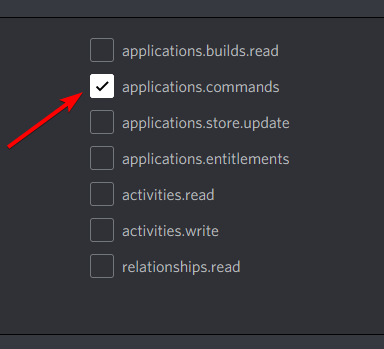

# Interactions

You must enable the `application.commands` scope for you bot if you want to use
your bot's application commands. If you don't need application commands, you can
skip this step. However for this tutorial, we will use an application command.

Note: Interactions are not limited to just application commands. For example,
message components such as buttons and select menus also fall under this
category.



Using [`core/http`](https://github.com/apacheli/whirlybird/tree/dev/core/http)
and helpers from
[`core/interactions`](https://github.com/apacheli/whirlybird/tree/dev/core/interactions)
to create a global application command:

```ts
import {
  chatInputCommand,
  HttpClient,
  integerOption,
  stringOption,
} from "./deps.ts";

const http = new HttpClient(BOT_TOKEN);

const command = chatInputCommand("ping", "ping pong command", {
  /* options */
});

await http.createGlobalApplicationCommand(APPLICATION_ID, command);
```

You can receive interactions either from the Discord gateway or from an HTTP
server.

If you're using the Discord gateway, you will receive a gateway event named
`INTERACTION_CREATE`. In your `handleEvent` function, you must make a case for
the `INTERACTION_CREATE` event.

```ts
const handleEvent: HandleEvent = (payload) => {
  switch (payload.t) {
    case GatewayEvents.InteractionCreate: {
      // ...
      break;
    }

    case GatewayEvents.MessageCreate: {
      // ...
      break;
    }
  }
};
```

You can use
[`core/http`](https://github.com/apacheli/whirlybird/tree/dev/core/http) to
respond to an interaction:

```ts
    case GatewayEvents.InteractionCreate: {
      const interaction = payload.d;

      if (interaction.data?.name === "ping") {
        await http.createInteractionResponse(interaction.id, interaction.token, {
          data: {
            content: "pong",
          },
          type: InteractionCallbackType.ChannelMessageWithSource,
        });
      }
      break;
    }
```

If you are running an HTTP server, you need your application's public key. To
get your application's public key, you can visit the
[Discord Developer Portal](https://discord.com/developers/applications).


You can import
[`core/interactions`](https://github.com/apacheli/whirlybird/tree/dev/core/interactions)
into your program.

In your `deps.ts` file:

```ts
export * from "https://github.com/apacheli/whirlybird/raw/dev/core/interactions/mod.ts";
```

It will provide a function named `handleRequestEvent`. This function will
automatically verify incoming requests for you.

```ts
import {
  type Handler,
  handleRequestEvent,
  InteractionCallbackType,
} from "./deps.ts";

const publicKey = Deno.env.get("PUBLIC_KEY") ?? prompt("public key:");
if (!publicKey) {
  throw new Error("Missing public key");
}

const handler: Handler = async (callback, interaction) => {
  if (interaction.data?.name === "ping") {
    await callback(InteractionCallbackType.ChannelMessageWithSource, {
      content: "pong",
    });
  }
};

const serve = async (conn: Deno.Conn) => {
  for await (const event of Deno.serveHttp(conn)) {
    handleRequestEvent(publicKey, event, handler);
  }
};

for await (const conn of Deno.listen({ port: 1337 })) {
  serve(conn);
}
```

It is mandatory to respond to an interaction. Otherwise, it will "fail." For
unwanted interactions, you can reply with an ephemeral message notifying the
user:

```ts
import { InteractionCallbackDataFlags } from "https://github.com/apacheli/whirlybird/raw/dev/core/types/mod.ts";

await callback(InteractionCallbackType.ChannelMessageWithSource, {
  content: "Do not do that!",
  flags: InteractionCallbackDataFlags.Ephemeral,
});
```


Congratulations! Your bot should now respond to your `/ping` command!
