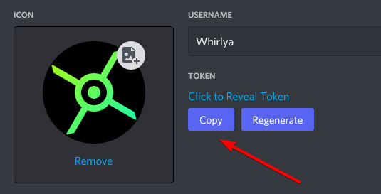
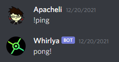

# Ping-Pong!

For this ping-pong example, you need to import 3 of the core modules:
[`core/gateway`](https://github.com/apacheli/whirlybird/tree/dev/core/gateway),
[`core/http`](https://github.com/apacheli/whirlybird/tree/dev/core/http), and
[`core/types`](https://github.com/apacheli/whirlybird/tree/dev/core/types).

In your `deps.ts` file:

```ts
export * from "https://github.com/apacheli/whirlybird/raw/dev/core/gateway/mod.ts";
export * from "https://github.com/apacheli/whirlybird/raw/dev/core/http/mod.ts";
export * from "https://github.com/apacheli/whirlybird/raw/dev/core/types/mod.ts";
```

In your `main.ts` file:

```ts
import {
  CacheClient,
  GatewayClient,
  GatewayEvents,
  GatewayIntents,
  type HandleEvent,
  HttpClient,
} from "./deps.ts";

const token = "Bot <TOKEN>";

const cache = new CacheClient();
const http = new HttpClient(token);

const handleEvent: HandleEvent = async (payload) => {
  cache.update(payload);

  switch (payload.t) {
    case GatewayEvents.MessageCreate: {
      if (payload.d.content === "!ping") {
        await http.createMessage(payload.d.channel_id, {
          content: "pong!",
        });
      }
      break;
    }
  }
};

const gateway = new GatewayClient(token, {
  handleEvent,
  intents: GatewayIntents.GuildMessages,
  ready: () => console.log("Hello, World!"),
  url: "wss://gateway.discord.gg?v=9",
});

await gateway.connect();
```

An explanation for what is going on here:

```ts
const token = "Bot <TOKEN>";
```

Replace `<TOKEN>` with your bot's token. To get your bot's token, you can visit
the [Discord Developer Portal](https://discord.com/developers/applications).



While it is unrecommended to hard-code your bot's token into your program, we
will do it here for demonstration purposes. You can also skip to
[Using Environment Variables](using_environment_variables.md) to see how you
should store tokens more safely.

The `handleEvent` function will run whenever a shard receives an incoming event
from the Discord gateway. At the top of the function, the cache will
automatically update based on the gateway event. In the next part of this code
snippet, whenever a message gets sent that says `!ping`, your bot will reply
with `pong!`.

```ts
const handleEvent: HandleEvent = async (payload) => {
  cache.update(payload);

  switch (payload.t) {
    case GatewayEvents.MessageCreate: {
      if (payload.d.content === "!ping") {
        await http.createMessage(payload.d.channel_id, {
          content: "pong!",
        });
      }
      break;
    }
  }
};
```

This part of the code creates our access to the Discord gateway. Whenever all
shards are ready, "Hello, World!" will be logged into your console. For
something as minimal as this, the only intent you will need to enable is guild
messages.

```ts
const gateway = new GatewayClient(token, {
  handleEvent,
  intents: GatewayIntents.GuildMessages,
  ready: () => console.log("Hello, World!"),
  url: "wss://gateway.discord.gg?v=9",
});
```



Finally, the last snippet will connect us to the Discord gateway.

```ts
await gateway.connect();
```
